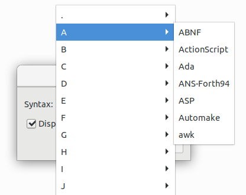
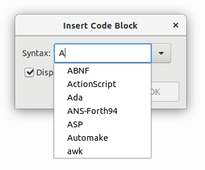

# Zim Sourceview (Autocomplete Language Feature)

In addition to the already existing "SourceView plugin" by Janoušek and Jaap Karssenberg this plugin adds three new features:

* the combobox has now a autocomplete feature which allows to select entries by typing part of their name. The previous behaviour (grouping by first letter) is still present.
* the ok button is now the default button. When the combobox has focus (default) the ok-button can be activated by pressing enter.
* the ok button gets automatically disabled when an invalid syntax is selected.

**Standard behaviour:**

**Autocomplete feature:**

# Setup

1. Put the `sourceview.py` into the plugins folder `~/.local/share/zim/plugins/` in Linux.
2. Enable the plugin in Zim via `Edit > Preferences > Plugins` and check mark the `Source View` plugin.
